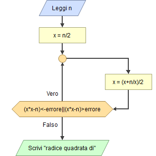

# Approssimazione della radice quadrata

Per calcolare la radice quadrata di un numero, si utilizzano diverse tecniche di approssimazione, come la scelta di un valore approssimato per la radice.

## Metodo Babilonese

Il **metodo babilonese** per il calcolo della radice quadrata di un numero $N$ consiste in una serie di approssimazioni successive. Inizialmente si sceglie un numero casuale (detto approssimazione iniziale) che sia maggiore o uguale a $N$. Successivamente si utilizza la seguente formula per ottenere una nuova approssimazione:

$$
x = (x + N/x) / 2
$$

dove $x$ è l'approssimazione corrente.

Il processo viene ripetuto utilizzando la nuova approssimazione come input fino ad ottenere una precisione desiderata denominata $ϵ$.

In pratica si ripete la formula finché la differenza tra l'approssimazione corrente e quella precedente sia minore di una certa soglia, come mostrato:

$$
|x_{n+1} - x_n| < ϵ
$$

Un ulteriore criterio potrebbe essere:

$$
\frac{|x_{n+1} - x_n| }{x_n} < ϵ
$$

E' un metodo molto efficace per calcolare la radice quadrata di un numero, sopratutto perché si basa su una serie di approssimazioni che tendono ad avvicinarsi sempre di più alla soluzione vera.

