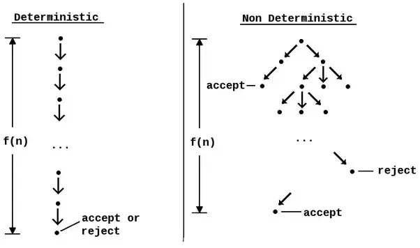

# Classi di complessità

In informatica si dividono i problemi in più classi di complessità, in base alla loro difficoltà di risoluzione. Queste classi sono:

- **P**: i problemi risolvibili in tempo polinomiale con una macchina di Turing deterministica.
- **NP**: i problemi possono essere risolti in tempo polinomiale con una macchina di Turing non deterministica. Questa classe è nota anche come _Non-deterministic Polynomial Time_.
- **NP-completo**: i problemi NP-completi sono i problemi più difficili di **NP**. Ogni problema NP completo è tale per cui è possibile ricondurre un qualsiasi problema NP a quest'ultimo.
- **EXP**: i problemi risolvibili in tempo esponenziale (o peggiore) con una macchina di Turing deterministica.

## Algoritmo deterministico

Un algoritmo deterministico è tale se, dato un particolare input, produrrà sempre lo stesso output, con la macchina sottostante che passa sempre attraverso la stessa sequenza di stati; il percorso di esecuzione dell’algoritmo è lo stesso in ogni esecuzione.

## Algoritmo non deterministico

Un algoritmo non deterministico (in inglese Non-deterministic Algorithms) è un algoritmo che, anche per lo stesso input, può esibire comportamenti diversi su corse diverse. In altre parole, è un algoritmo in cui il risultato di ogni algoritmo non è definito in modo univoco e il risultato potrebbe essere casuale.

Una varietà di fattori può far sì che un algoritmo si comporti in modo non deterministico:

- Se utilizza uno stato esterno diverso dall’input (l’input dell’utente, un valore casuale o dati memorizzati nel disco).
- Se funziona in modo sensibile al tempo, ad esempio se ha più processori che scrivono sugli stessi dati contemporaneamente. In questo caso, l’ordine preciso in cui ciascun processore scrive i propri dati influirà sul risultato.
- Se un errore hardware fa sì che il suo stato cambi in modo imprevisto.

## NP

La classe NP è una classe di problemi che possono essere risolti in tempo polinomiale con una macchina di Turing non deterministica. Questa classe è nota anche come _Non-deterministic Polynomial Time_.  La sua caratteristica è che un algoritmo appartenente a NP è verificabile in tempo polinomiale

:::tip
**Consiglio:**  per pensare a come risolvere in modo polinomiale un problema di questo tipo, ipotizza di avere un numero sufficiente di computer in grado di calcolare, contemporaneamente, la soluzione di un problema eseguendo ciascuna un percorso diverso. In questo modo, si può risolvere il problema in tempo polinomiale.
:::

:::danger
**Attenzione**: NP sta per **Non-Deterministic**, non per Non-Polynomial!
:::

## NP-completo

Nella teoria della complessità, un problema NP-completo o NPC (cioè un problema completo per la classe NP) è un problema decisionale che verifica le seguenti proprietà:

- è possibile **verificare** una soluzione in modo efficiente (in tempo polinomiale); la classe di problemi che verificano questa proprietà è indicata con NP;
- tutti i problemi della classe NP si riducono a questa tramite una _riduzione polinomiale_; questo significa che il problema è difficile almeno quanto tutti gli altri problemi della classe NP.

Se dunque venisse scoperto un modo per rendere polinomiale un problema **NP-completo**, ne seguirebbe che lo stesso metodo potrebbe essere applicato a tutti i problemi NP, e quindi anche a tutti i problemi P.

## EXP

La classe di complessità **EXP** si riferisce ai problemi che possono essere risolti in **tempo esponenziale**. In altre parole, un problema appartenente alla classe di complessità EXP può essere risolto utilizzando un algoritmo che impiega un tempo di esecuzione che cresce esponenzialmente con la dimensione dell'input. Ad esempio, un algoritmo appartenente alla classe di complessità EXP potrebbe impiegare 2^n unità di tempo per risolvere un problema di dimensione n, dove n è il numero di elementi dell'input.

Questa include molti dei problemi NP-completi, ovvero problemi che non possono essere risolti in tempo polinomiale ma che possono essere risolti in modo efficiente utilizzando algoritmi appartenenti alla classe NP. Tuttavia, non tutti i problemi NP-completi appartengono alla classe di complessità EXP, poiché esistono algoritmi di approssimazione che possono risolvere alcuni problemi NP-completi in tempo polinomiale.

In generale, la classe di complessità EXP rappresenta un limite superiore per la risoluzione efficiente dei problemi di ottimizzazione, poiché problemi appartenenti a questa classe possono richiedere tempi di esecuzione molto lunghi per input di dimensioni moderate. Tuttavia, grazie ai progressi della ricerca in campo informatico, nuovi algoritmi e metodi di risoluzione vengono continuamente sviluppati che possono risolvere problemi appartenenti alla classe di complessità EXP in modo più efficiente.

### Soluzioni imperfette

Fino ad ora, tutti gli algoritmi conosciuti per problemi NP-Completi necessitano di un tempo superpolinomiale nella dimensione dell'input. L'esistenza di algoritmi più veloci è sconosciuta. Quindi, per risolvere un problema NP-Completo di dimensioni non banali, generalmente vengono utilizzati i seguenti approcci:

- algoritmo di approssimazione: un algoritmo che trova velocemente una soluzione sub-ottimale che si trova in un intorno (noto) di quella ottimale.
- algoritmo probabilistico: un algoritmo il cui tempo medio di esecuzione per una distribuzione data del problema è provata essere buona—idealmente, uno che assegna una bassa probabilità a input "difficili".
- casi speciali: un algoritmo veloce se l'istanza del problema appartiene all'insieme di alcuni casi speciali. La parametrizzazione della complessità può essere vista come una generalizzazione di questo approccio.
- euristica: un algoritmo che funziona "ragionevolmente bene" in molti casi, ma per cui non c'è prova che sia sempre veloce e che dia buoni risultati.

---

## Domande di esame

Di seguito sono riportati alcuni esempi di domande di esame che possono essere utili per prepararsi all'esame di **Computabilità e Complessità**.

### Dimostrare che un algoritmo appartenente a P è anche appartenente a NP

In generale, un problema appartiene a P se può essere risolto in tempo polinomiale, mentre un problema appartiene a NP se può essere verificato in tempo polinomiale.

Per dimostrare che NP include (non siamo ancora in grado di dire se strettamente o meno) P, dobbiamo dimostrare che ogni problema di P può essere verificato in tempo polinomiale. Questo è possibile in quanto ogni problema di P può essere risolto in tempo polinomiale da una macchina di Turing deterministica e dunque anche verificato. 

### Perchè la scomposizione fattoriale è un problema appartenente a NP?

La scomposizione fattoriale è un problema appartenente a NP perché può essere verificata in tempo polinomiale. In altre parole, esiste un algoritmo che può verificare se una data scomposizione di un numero intero in fattori primi è corretta in un numero di passi che cresce in modo polinomiale rispetto alla dimensione dell'input.

_Per fare un esempio concreto_, supponiamo di avere un numero intero `n` e di voler verificare se può essere scritto come prodotto di fattori primi. Un modo per farlo potrebbe essere quello di cercare tutti i fattori primi del numero `n`, **uno per uno**, e verificare se il prodotto di questi fattori è uguale a `n`. In questo caso, il tempo di esecuzione dell'algoritmo cresce in modo polinomiale rispetto alla dimensione dell'input, poiché il numero di fattori primi che occorre considerare è proporzionale alla logaritmo del numero n. Pertanto, la scomposizione fattoriale appartiene a NP, **non** avendo un modo per eseguire il calcolo in tempo polinomiale su una macchina deterministica.

### Quale è la complessità di verificare se un elemento è presente all'interno di un vettore? Come cambia se è ordinato o meno?

La complessità di verifica se un elemento è all'interno di un vettore non ordinato dipende dall'algoritmo utilizzato per effettuare la verifica. Un modo semplice per farlo potrebbe essere quello di scorrere tutti gli elementi del vettore uno per uno e verificare se l'elemento cercato è presente. In questo caso, la complessità dell'algoritmo è lineare ovvero O(n), poiché il numero di passi necessari per trovare l'elemento cercato è proporzionale alla dimensione del vettore.

Tuttavia, esistono altri algoritmi che possono essere utilizzati per effettuare la verifica in modo più efficiente. Ad esempio, se il vettore è costituito da numeri interi, è possibile utilizzare un algoritmo di ricerca binaria per trovare l'elemento cercato in tempo logaritmico. In questo caso, la complessità dell'algoritmo sarebbe pari a O(log n), dove n è la dimensione del vettore. Questo significa che il numero di passi necessari per trovare l'elemento cercato cresce in modo logaritmico rispetto alla dimensione del vettore, rendendo l'algoritmo più efficiente rispetto al primo approccio.

Se si dovesse però considerare anche il tempo di ordinamento del vettore, tale approccio risulterebbe sconveniente in quanto richiederebbe  O(n log n) per ordinare a cui si somma O(log n) per la ricerca binaria con un totale di O(n log n + log n) = O(n log n).

### Quale è la complessità di verificare se, dato un insieme finito di numeri, esista un sottoinsieme non vuoto a somma negativa?"

La complessità di verifica che esista un sottoinsieme non vuoto a somma negativa dipende dall'algoritmo utilizzato per effettuare la verifica. Un modo semplice per farlo potrebbe essere quello di scorrere tutti i sottoinsiemi del vettore uno per uno e verificare se la somma degli elementi di ciascun sottoinsieme è negativa. In questo caso, la complessità dell'algoritmo sarebbe esponenziale, poiché il numero di sottoinsiemi da considerare cresce esponenzialmente con la dimensione del vettore.

Tuttavia, esistono altri algoritmi che possono essere utilizzati per effettuare la verifica in modo più efficiente. Ad esempio, si può utilizzare un algoritmo di ricerca dicotomica per trovare un sottoinsieme a somma negativa in tempo polinomiale. In questo caso, la complessità dell'algoritmo sarebbe pari a O(n log n), dove n è la dimensione del vettore. Questo significa che il numero di passi necessari per trovare il sottoinsieme cercato cresce in modo polinomiale rispetto alla dimensione del vettore, rendendo l'algoritmo più efficiente rispetto al primo approccio.

In generale, quindi, la complessità di verifica che esista un sottoinsieme non vuoto a somma negativa dipende dall'algoritmo utilizzato e dalle caratteristiche del vettore stesso.

### Quale è la complessità di verifica, dato un insieme finito di stringhe, quali siano tutti gli anagrammi che iniziano con A?

 la complessità di un algoritmo per verificare gli anagrammi può essere O(n^2) nella peggiore delle ipotesi, dove n è il numero di stringhe nell'insieme. In questo caso, l'algoritmo potrebbe essere migliorato utilizzando una mappa di frequenza delle lettere per verificare se una stringa è un anagramma di un'altra, il che ridurrebbe la complessità dell'algoritmo a O(n * m), dove m è il numero medio di lettere in una stringa.

 ---

## Bibliografia

- [What are the differences between NP, NP-Complete and NP-Hard?](https://stackoverflow.com/questions/1857244/what-are-the-differences-between-np-np-complete-and-np-hard)
- [Differenza tra algoritmo deterministico e non deterministico in informatica](https://vitolavecchia.altervista.org/differenza-tra-algoritmo-deterministico-e-non-deterministico-in-informatica/)
- [NP-completo](https://it.wikipedia.org/wiki/NP-completo)